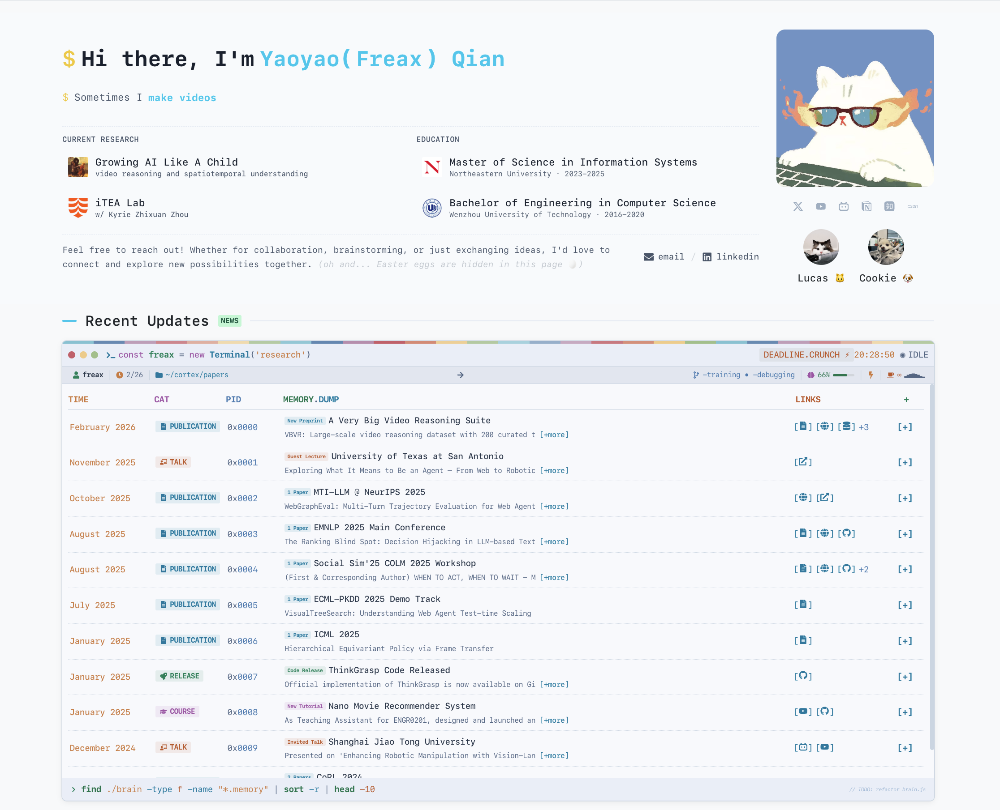
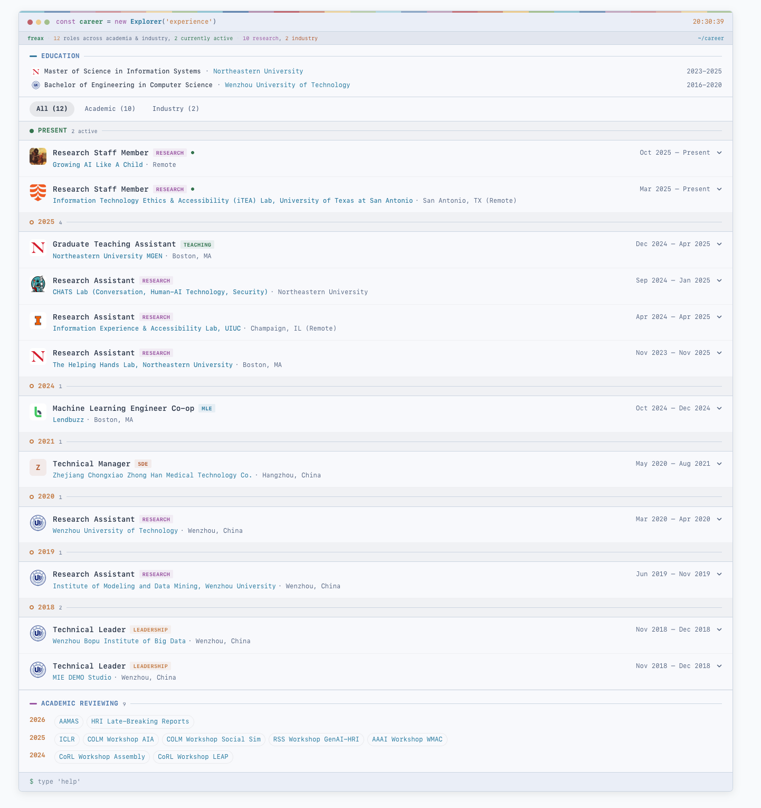
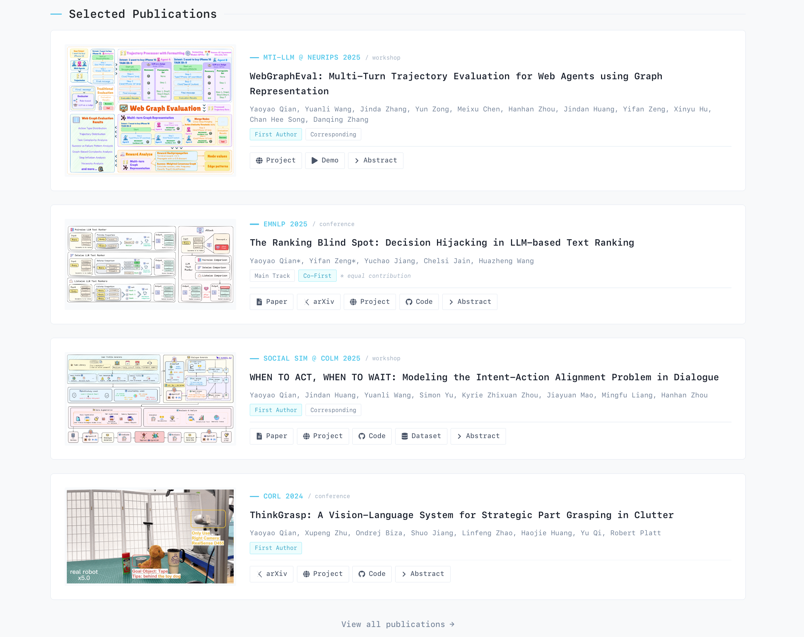
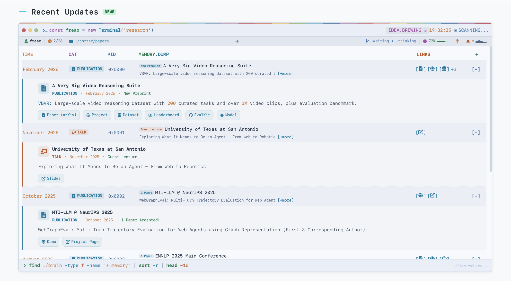

<!--
SPDX-FileCopyrightText: 2026 Yaoyao(Freax) Qian <limyoonaxi@gmail.com>
SPDX-License-Identifier: GPL-3.0-only
-->

<p align="right">
  <a href="README.md">English</a> | <a href="README_CN.md">中文</a>
</p>

<p align="center">
  
</p>

<p align="center">
  <strong>上传简历，生成主页。</strong><br/>
  <sub>面向开发者、研究者和创作者的终端风格个人作品集。编辑文本文件或通过 MCP 让 AI 自动完成。</sub>
</p>

<p align="center">
  <a href="https://term-hub.vercel.app/"></a>
  <a href="https://h-freax.github.io/"></a>
  <a href="https://term-hub.vercel.app/guide"></a>
  <a href="https://discord.gg/QV2kyXzaTa"></a>
</p>

<p align="center">
  <a href="https://www.gnu.org/licenses/gpl-3.0"></a>
  
  
  
  
  <a href="#-ai-集成--支持-mcp"></a>
</p>

---

> [!TIP]
> **不想碰代码？** 我们正在搭建托管平台 **[terminalai.com](https://terminalai.com)** —— 上传简历即可生成在线作品集，无需 Git 或终端。**加入 Waitlist** 抢先体验！

<br/>

##  演示

<p align="center">
  <a href="https://term-hub.vercel.app/">
    
  </a>
  <br/>
  <sub><a href="https://term-hub.vercel.app/">term-hub.vercel.app</a> — 使用 TermHub 构建</sub>
</p>

<details>
<summary></summary>

<br/>

| | |
|:---:|:---:|
|  |  |
|  |  |
|  |  |
|  |  |
|  |  |
|  |  |
|  |  |
|  |  |

</details>

<br/>

##  设计理念

TermHub 围绕一个简单的理念构建：

<p align="center">
  
  
  
  
  
  
  
</p>

无需编写 HTML 或学习框架，只需将简历交给任何 AI —— **ChatGPT、Claude、Gemini 或任何大语言模型** —— 它会生成 Markdown 文件，直接接入 TermHub。适用于开发者、研究人员、设计师、学生 —— 任何想要专业作品集的人。通过我们的**内置 MCP 服务器**，Claude 可以全自动完成：读取你的简历，调用 19 个专用工具，一分钟内填充整个网站。

<br/>

##  功能特性

<table>
<tr>
<td width="50%">


-  终端美学 + Nord 配色方案
-  深色 / 浅色模式切换
-  完全响应式（手机 → 桌面）
-  编辑内容文件，网站即时更新
-  一条命令完成初始化
-  只需编辑文本文件
-  简历 → AI → 作品集，分钟级完成

</td>
<td width="50%">


-  项目展示，支持标签和链接
-  时间线，支持机构 Logo
-  Markdown 博客文章
-  学术论文，支持作者高亮
-  黑客松、奖学金、荣誉奖项
-  公告和最新消息

</td>
</tr>
</table>

<br/>

##  快速开始

```bash
# 1. Fork 并克隆
git clone https://github.com/H-Freax/TermHub.git
cd TermHub && npm install

# 2. 运行设置向导 — 生成你的配置
npm run setup

# 3. 启动开发服务器
npm run dev
```

> 打开 **http://localhost:5173** —— 你的网站已经运行。
> 编辑 `content/` 中的文件，保存后浏览器会自动刷新。

<br/>

##  编辑内容

所有内容都在**一个文件夹**中 —— 你无需触碰源代码。

```
content/
├── site.json              ← 姓名、邮箱、社交链接、功能开关
├── about.md               ← 个人简介 & 职业时间线
├── experience.json        ← 工作 & 教育经历
├── publications/          ← 每篇论文一个 .md 文件
├── projects/              ← 每个项目一个 .md 文件
├── articles/              ← 每篇博客一个 .md 文件
├── news.json              ← 公告动态
├── awards.json            ← 获奖荣誉
└── images/                ← 头像、Logo、截图
```

<details>
<summary> 显示或隐藏整个页面</summary>

<br/>

在 `content/site.json` 中开启或关闭功能：

```json
{
  "features": {
    "publications": true,
    "projects": true,
    "articles": true,
    "experience": true,
    "news": true,
    "pets": false,
    "guide": false
  }
}
```

当某个功能设为 `false` 时，对应的页面和导航链接会完全消失。

</details>

<br/>

##  部署

| 平台 | 方式 |
|------|------|
|  | 推送到 `main` —— 内置的工作流会自动部署 |
|  | 导入仓库 → 点击部署（自动识别 Vite） |
|  | 导入仓库 → 点击部署 |

<br/>

##   AI 集成 — 支持 MCP

**简历 → AI → Markdown → 个人主页** 的终极形态：TermHub 内置 **MCP 服务器**，让 Claude 直接读取你的简历、生成所有 Markdown/JSON 内容文件并构建网站 —— 零手动编辑。

<table>
<tr>
<td width="50%">


-  将简历 PDF 或文本交给 AI，获得完整网站
-  通过 AI 添加论文、项目、经历、获奖
-  内置 PDF 文本提取
-  AI 可启动开发服务器并构建网站

</td>
<td width="50%">


```bash
# 1. 安装 MCP 服务器
cd mcp-server && npm install

# 2. 配置 Claude Desktop / Code
# （参见 mcp-server/mcp-config.json）

# 3. 告诉 Claude：
# "解析我的简历并生成我的作品集"
```

</td>
</tr>
</table>

<details>
<summary></summary>

<br/>

| 工具 | 说明 |
|------|------|
| `get_schema` | 获取所有数据类型 — AI 首先调用此工具 |
| `parse_pdf` | 从简历 PDF 中提取文本 |
| `generate_from_resume` | 从简历文本生成结构化蓝图 |
| `update_site_config` | 设置姓名、邮箱、社交链接 |
| `add_publication` | 添加论文及完整元数据 |
| `add_project` | 添加项目，包含标签和亮点 |
| `add_experience` | 添加工作/研究经历 |
| `add_education` | 添加教育经历 |
| `add_news` / `add_award` | 添加动态和获奖 |
| `write_markdown_content` | 写入任意 Markdown 内容文件 |
| `write_json_content` | 写入任意 JSON 内容文件 |
| `manage_assets` | 复制图片到 public 目录 |
| `preview_site` | 启动开发服务器或生产构建 |
| `get_site_status` | 查看当前作品集内容概览 |
| `reset_content` | 清除所有内容，重新开始 |

</details>

> **工作流：** 简历 → `parse_pdf` → `generate_from_resume` → AI 调用 `add_*` 工具 → `preview_site` —— 一分钟内完成。

详细配置说明请参阅 [AI 集成指南](https://term-hub.vercel.app/docs#mcp-server)。

<br/>

##  技术栈

<table>
<tr>
<td align="center" width="96"><br/><strong>React 18</strong><br/><sub>UI 框架</sub></td>
<td align="center" width="96"><br/><strong>TypeScript</strong><br/><sub>类型安全</sub></td>
<td align="center" width="96"><br/><strong>Vite 5</strong><br/><sub>构建工具</sub></td>
<td align="center" width="96"><br/><strong>Chakra UI</strong><br/><sub>组件库</sub></td>
<td align="center" width="96"><br/><strong>Framer</strong><br/><sub>动画效果</sub></td>
<td align="center" width="96"><br/><strong>Nord</strong><br/><sub>配色方案</sub></td>
</tr>
</table>

<br/>

##  参与贡献

欢迎贡献！你可以：

-  给仓库加星表示支持
-  提交 Bug 报告或功能建议
-  请先查看 [CONTRIBUTING.md](CONTRIBUTING.md)
-  [加入我们的 Discord](https://discord.gg/QV2kyXzaTa) 交流讨论

<br/>

##  许可证

**GPL-3.0-only** · 版权所有 © 2026 [Yaoyao (Freax) Qian](https://h-freax.github.io/)
